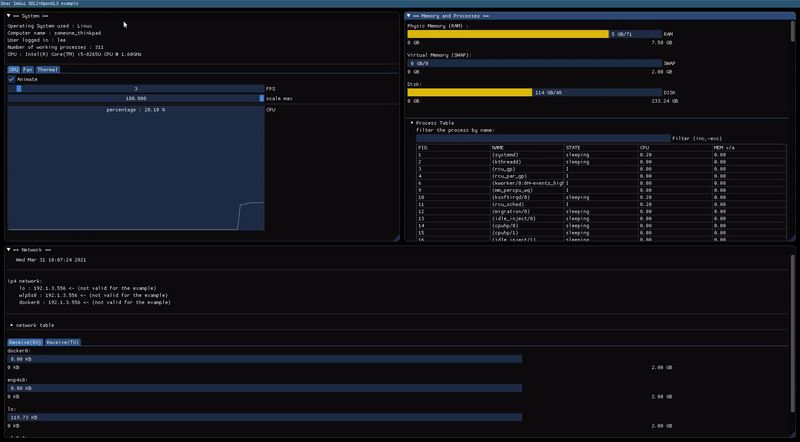
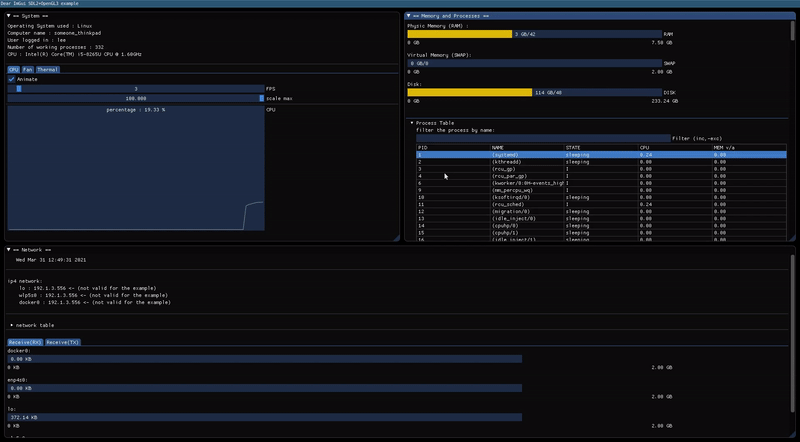
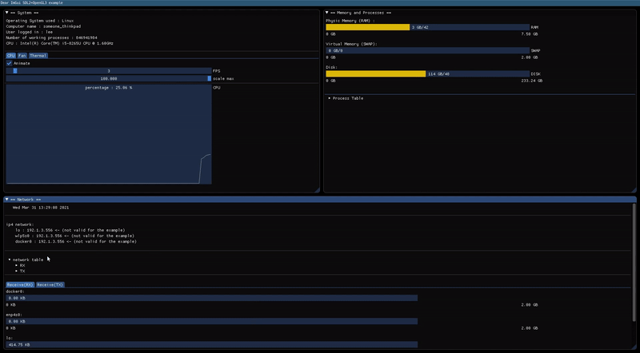

## System Monitor

### Objectives

The objective for this project is to show that you have acquired programming logic and that you are able to adapt to new languages.

The programming language you are about to use is [C++](https://en.wikipedia.org/wiki/C%2B%2B). It will not be asked to create
a project from scratch, instead you will have **to add features or fix the code of a given application**.

The application you are about to work on is a [**Desktop System Monitor**](https://en.wikipedia.org/wiki/System_monitor). The app will monitor the computers system resources and performance, such as CPU, RAM, SWAP, Fan, Network, etc.
For the GUI you will use the [_Dear ImGui_](https://github.com/ocornut/imgui/wiki#about-the-imgui-paradigm) library for C++.

### Instructions

#### **Dear ImGui**

As stated above the GUI you are going to use is _Dear ImGui_ there are somethings you should know about this library/API.

The first important point to be aware is that ImGui is an **immediate mode graphic user interface**, as the name clearly says "ImGui".
For better understanding there are two types of UIs, **retained mode** and **immediate mode**.

- **Immediate mode**: application state is separated from the graphics library. It’s the application responsibility for drawing commands when necessary. In other words, in immediate mode the client calls directly cause rendering of graphics objects to the display.

- **Retained mode**: the client calls do not directly cause actual rendering, but instead updates an abstract internal model, which is maintained within the library's data space. You can see more about this mode [here](https://en.wikipedia.org/wiki/Retained_mode).

For this API there is no need for specifics builds, you can add the files to your existing project.
To integrate Dear ImGui you must use a backend, this backend passes mouse/keyboard/gamepad inputs and variety of settings and it is
in charge of rendering the resulting vertices.

The backend will be provided by us, in a file system described in the next topic.
You will have to install `sdl` by running the command `apt install libsdl2-dev`.

---

#### **File System**

The file system provided, [here](https://downgit.github.io/#/home?url=https://github.com/01-edu/public/tree/master/subjects/system-monitor/system-monitor), will contain all the ImGui IPA, you can better understand the fs referring to what is listed below.

```console
$ tree system-monitor
├── header.h
├── imgui                                 // <-- ImGui APIs
│   └── lib
│       ├── backend                       // <-- ImGui backend
│       │   ├── imgui_impl_opengl3.cpp
│       │   ├── imgui_impl_opengl3.h
│       │   ├── imgui_impl_sdl.cpp
│       │   └── imgui_impl_sdl.h
│       ├── gl3w
│       │   └── GL
│       │       ├── gl3w.c
│       │       ├── gl3w.h
│       │       └── glcorearb.h
│       ├── imconfig.h
│       ├── imgui.cpp
│       ├── imgui_demo.cpp
│       ├── imgui_draw.cpp
│       ├── imgui.h
│       ├── imgui_internal.h
│       ├── imgui_tables.cpp
│       ├── imgui_widgets.cpp
│       ├── imstb_rectpack.h
│       ├── imstb_textedit.h
│       └── imstb_truetype.h
├── main.cpp                             // <-- main file, where the application will
├── Makefile                             //     render (main loop)
├── mem.cpp                              // <-- memory resources and processes information
├── network.cpp                          // <-- network resources
└── system.cpp                           // <-- all system resources

5 directories, 28 files
```

---

#### **Linux and Proc**

To monitor the computers system resources and performance you will have to use the `/proc` filesystem.

The `/proc` filesystem is a virtual system that does not exist on disk, this system is created by the kernel when the system boots, and destroyed by it
when the system shuts down.

This filesystem contains information about the system, from the CPU, to memory, to active processes and much more. For this reason it can be regarded as
a control and information centre for the kernel. As a matter of fact, allot of the system utilities are simple calls to files in this directory.

You can acquire more knowledge about this filesystem by taking a look to the `proc` manuel page (`man proc`).

---

#### **Monitorization**

For this project you must present the following monitorization:

- **System monitor**, that will contain :
  - The type of OS (Operating System).
  - The user logged into the computer.
  - The computer name, this being the **hostname**.
  - The total number of tasks/processes that are currently running, sleeping, uninterrruptible, zombie, traced/stopped or interrupted.
  - Type of CPU
  - A tabbed section containing `CPU`, `Power`, `Fan` and `Thermal` information, this information include a performance graphic for all those topics.
    This graph should contain some kind of checkbox or button to be able to stop the animation whenever the user desires to do so, and two slider bars.
    The first slider bar should be able to control the `FPS` of the graph, and the second slide bar should control the `y` scale of the graph.

    - `CPU` should present this graph with a overlay text saying the current percentage of the CPU.

    - `Fan`, should include the following information, the status of the fan, (enable/active), the current speed and the level. And should also present the graph stated above.

    - `Thermal`, should present the graph state above with a overlay text saying the current temperature of the computer.

    example :

    

- **Memory and process monitor**, that will contain :
  - The Physic Memory (RAM) being used, it must have some kind of visual display of this usage.
  - The Virtual Memory (SWAP) being used, it should also include a visual display.
  - The Disk usage, same here.
  - A tab bar that should contain a table of processes with the following columns :
    - **PID**, with the process identification.
    - **Name**, name of the process.
    - **State**, current state of the process.
    - **CPU usage**, how much CPU the process is consuming in percentage.
    - **Memory usage**, how much memory the process is consuming in percentage.
  - A text box that lets the user filter the table. Users must be able to select multiple rows of the table.

    example :

    

- **Network**, that will contain :
  - The network ipv4, (`lo`, `wlp5s0` and other networks that the computer may have).
  - A tab bar that should contain two tables :
    - `RX` (network receiver) containing the following data : bytes, packets, errs, drop, fifo, frame, compressed and multicast.
    - `TX` (network transmitter) containing the following data : bytes, packets, errs, drop, fifo, colls, carrier and compressed.
  - It should also contain a tabbed section for both `RX` and `TX`, those sections should display a visual usage (ex: progress bar), of all network present on the computer. This visual display should obey the following rules:
    - Each network should be converted from **bytes** to **GB**, **KB** or **MB** depending on the value. It should not display values that
      are to big or to small

      example :

      **452755738 bytes** => **431.78 MB**.       // perfect\
      **452755738 bytes** => **0.42 GB**.         // to small\
      **452755738 bytes** => **442144.28.6 KB**.  // to big

  - The visual display should go from 0GB to 2GB

  example :

  

This project will help you learn about:

- C++ programming language
- UI/UX
  - Dear ImGui
- CPU
- Memory
  - SWAP
  - RAM
  - Disk
- Network
- Linux filesystem
  - proc
  - sysfs
