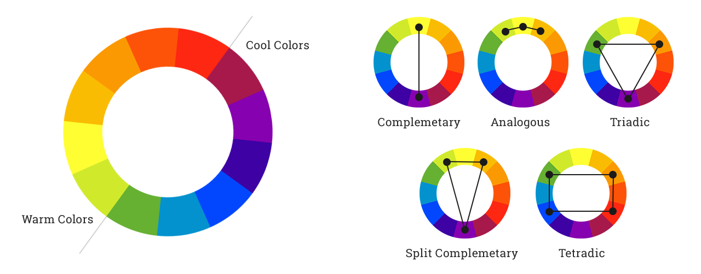
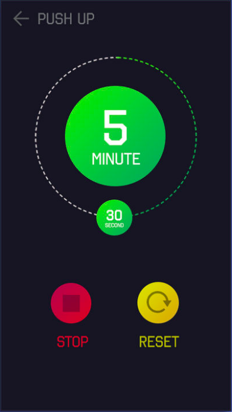
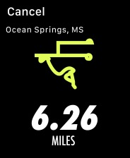
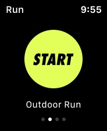
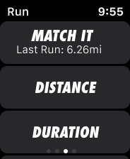
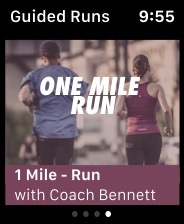
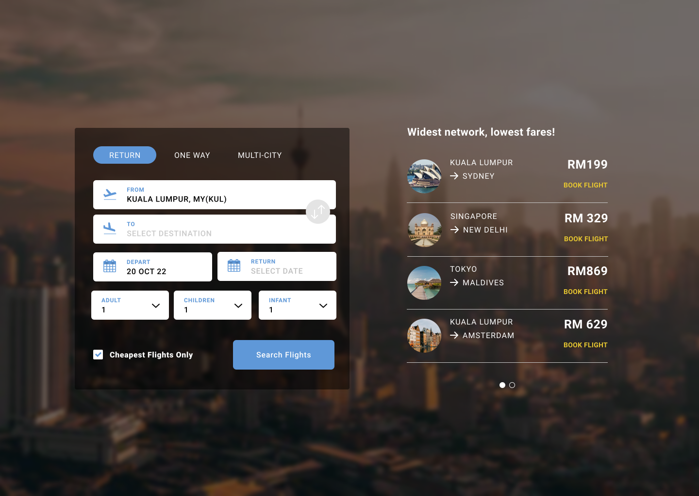
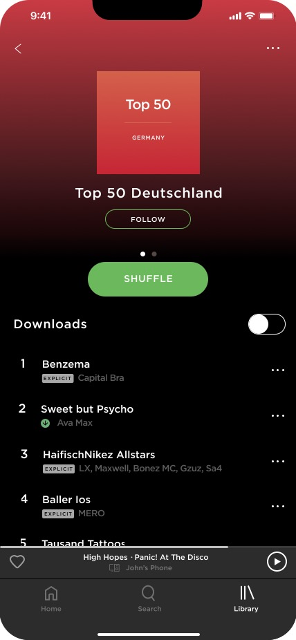
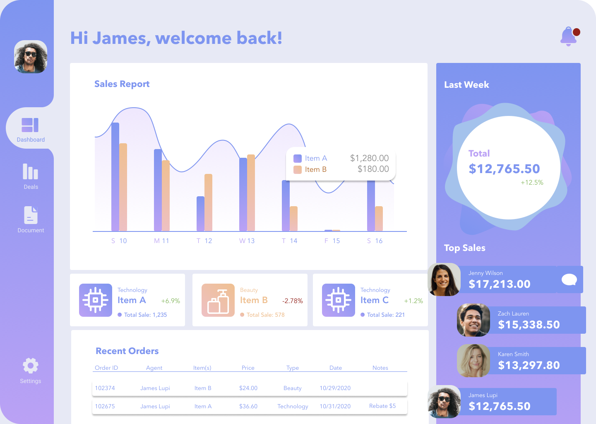

## Find the colors

**Context:**

This first UI quest is a series of exercises to practice colors, moodboards, typography and replicate screens on Figma!

### Instructions

Go to the following 7 websites and make the color palettes out of them (3 to 4 main colors).

- [https://www.komoot.com/](https://www.komoot.com/) (App)
- [https://www.airtable.com/](https://www.airtable.com/)
- [https://www.decathlon.com/collections/kids-gift-ideas](https://www.decathlon.com/collections/kids-gift-ideas)
- [https://www.jrpass.com/](https://www.jrpass.com/)
- [https://www.thesiff.com/](https://www.thesiff.com/)
- [https://brave.com/es/](https://brave.com/es/)
- [https://www.ted.com/](https://www.ted.com/)

**Deliverable:**

- A Figma file including screenshots of the main page for all the 7 websites, URL and extracted colors next to the screenshots.

Don't forget to:

- Upload the Figma file on Github, labeled as follows: “Name_FirstName_DeliverableName_Date_VersionNumber”. For example, it can be labeled as “Doe_John_MidFiPrototype_05242024_V1”.
- Add a title within the file.

**Tips:**

- You can use Figma to extract the colors you need and export your file to PDF.
- Use the Color Pipette to extract the colors!
- You can show the main colors with filled squares or circles next to the screenshots.
- Mind the aesthetics of your deliverable! 1 page per site should be good.

**Resources:**

- [Video tutorial on Figma](https://www.youtube.com/watch?v=FTFaQWZBqQ8)
- [Beginning graphic design](https://edu.gcfglobal.org/en/beginning-graphic-design/)
- [Gareth graphic studio](https://www.youtube.com/c/GarethDavidStudio)

## Color codes

### Instructions

Go to these 7 websites and make the color palettes out of them (3 to 4 main colors).

**Deliverable:**

- A Figma file including screenshots of the main page, URL, extracted colors and the matching color codes.

Don't forget to :

- Upload the Figma file on Github, labeled as follows: “Name_FirstName_DeliverableName_Date_VersionNumber”. For example, it can be labeled as “Doe_John_MidFiPrototype_05242024_V1”.
- Add a title within the file.

**Tips:**

- You can use the document from the previous exercise to add the color codes on Figma.
- Use the Color Pipette to detect the color codes!
- Pay attention to the global aspect of the file. It must be clear, simple and easy to read. You can get inspiration [canva](https://www.canva.com/) but don’t overload your design with too much details!

**Resources:**

- [Beginning graphic design](https://edu.gcfglobal.org/en/beginning-graphic-design/)
- [Gareth graphic studio](https://www.youtube.com/c/GarethDavidStudio)

- [https://www.komoot.com/](https://www.komoot.com/) (App)
- [https://www.airtable.com/](https://www.airtable.com/)
- [https://www.decathlon.com/collections/kids-gift-ideas](https://www.decathlon.com/collections/kids-gift-ideas)
- [https://www.jrpass.com/](https://www.jrpass.com/)
- [https://www.thesiff.com/](https://www.thesiff.com/)
- [https://brave.com/es/](https://brave.com/es/)
- [https://www.ted.com/](https://www.ted.com/)

## Color combinations

### Instructions

Let's browse!

Find 3 digital products (websites or apps) that use each kind of color palette combination:

- Monochromatic
- Analogous
- Complementary
- Split complementary
- Triadic
- Double complementary

You need 3 websites or apps per color palette combination!

**Deliverable:**

- A Figma file including for each digital product (websites or apps):

  - screenshots of the main page.
  - the matching URL.
  - the main colors.
  - the kind of color combination.

Don't forget to:

- Upload the Figma file on Github, labeled as follows: “Name_FirstName_DeliverableName_Date_VersionNumber”. For example, it can be labeled as “Doe_John_MidFiPrototype_05242024_V1”.
- Add a title within the file.

**Tips:**

- You can find HSB (Hue, Saturation, Brightness) as well as HSV (Hue, Saturation, Value) depending of the source.
- Pay attention to the global aspect of the file. It must be clear, simple and easy to read. You can get inspiration [canva](https://www.canva.com/) but don’t overload your design with too much details!

**Resources:**

- [https://coloursandmaterials.wordpress.com/2014/09/16/colour-system/](https://coloursandmaterials.wordpress.com/2014/09/16/colour-system/)
- 

**Example:**

**Monochromatic:**

- [https://www.benefitcosmetics.com/](https://www.benefitcosmetics.com/)
- [http://www.jwilouvres.com.au/](http://www.jwilouvres.com.au/)
- [http://blank.com.pt/](http://blank.com.pt/)

**Analogous:**

- [https://www.natuurenmilieu.nl/](https://www.natuurenmilieu.nl/)
- [https://campesinorum.com/](https://campesinorum.com/)
- [https://www.lobster.es/](https://www.lobster.es/)

**Complementary:**

- [https://www.rolandgarros.com/](https://www.rolandgarros.com/fr-fr)
- [https://squilla.io/](https://squilla.io/)
- [https://gomim.com/en/](https://gomim.com/en/)

**Split complementary:**

- [https://flythenest.io/en/](https://flythenest.io/en/)
- [https://www.kineuphorics.com/](https://www.kineuphorics.com/)
- [https://www.ma-tea.de/](https://www.ma-tea.de/)

**Triadic**

- [https://normalnow.com/](https://normalnow.com/)
- [https://brainbakery.com/en/](https://brainbakery.com/en/)
- [https://www.barkbox.com/](https://www.barkbox.com/)

**Dual complementary or Tetradic**

- [https://www.airtable.com/](https://www.airtable.com/)
- [https://calendar.google.com/](https://calendar.google.com/)
- [https://www.ebay.com/](https://www.ebay.com/)

## Moodboard

### Instructions

Create 4 different moodboards based on these 4 briefs and extract a color palette.

**Briefs:**

- 1: A physics teacher that wants to make his website catchy for 12 year-olds.
- 2: A Sri Lankan wedding planner website that wants to breathe sobriety and modernity.
- 3: An e-commerce platform that sells West African wax and wants to feel more luxurious in its spirit to stand out.
- 4: An NGO that helps parents of kids with autism, wants to spread joy and hope for a fundraiser.

### Deliverables

- A Figma file per moodboard.
- On each moodboard, several pictures (5 to 12) that are graphically consistent in terms of colors.
- The main colors extracted and shown on the side.
- One color code per color (RGB, Hex or HSB).

Don't forget to:

- Upload the documents on Github, in a zip folder named “ProjectTitle_Name_FirstName”, with all project deliverables as follows: “Name_FirstName_DeliverableName_Date_VersionNumber”. For example, the first deliverable can be named as “Doe_John_MidFiPrototype_05242024_V1”.
- Add a title within all written documents.

**Tips:**

- [Use freely-usable images!](https://buffer.com/library/free-images/)
- Examples of moodboards (in addition, the moodboard should include the color codes):
  - [Example1](https://lovestylecomunicacion.com/wp-content/uploads/2017/09/A.png)
  - [Example2](https://caseperlatesta.com/wp-content/uploads/2015/09/Moodboard23_grey_peach-1024x1024.jpg)
  - [Example3](https://i.pinimg.com/564x/ee/9d/d6/ee9dd6fbb82b0e5b4dd2924580b765dd.jpg)
- Pay attention to the global aspect of the deliverables. They must be clear, simple and easy to read. You can get inspiration [canva](https://www.canva.com/) but don’t overload your design with too much details!

## Typography

### Instructions

Go to these websites and detect the typographies used.

- [https://unric.org/no](https://unric.org/no)
- [https://www.strongbowcider.com/bug-exterminator-brisbane](https://www.strongbowcider.com/bug-exterminator-brisbane)
- [http://www.bbqgrillsandfire.com/](http://www.bbqgrillsandfire.com/)
- [https://pt.wikipedia.org/wiki/Mario_Botta](https://pt.wikipedia.org/wiki/Mario_Botta)
- [https://skyinvestigations.com/](https://skyinvestigations.com/)
- [https://bumble.com/](https://bumble.com/)
- [https://adopte1poule.fr/](https://adopte1poule.fr/)
- [http://slaveryfootprint.org/](http://slaveryfootprint.org/)
- [https://www.tomorrowland.com/fr/festival/bienvenue](https://www.tomorrowland.com/fr/festival/bienvenue)
- [https://artisanscanada.com/](https://artisanscanada.com/)

### Deliverables

- A Figma file showing all the typographies used in each website or app.

Don't forget to:

- Upload the Figma file on Github, labeled as follows: “Name_FirstName_DeliverableName_Date_VersionNumber”. For example, it can be labeled as “Doe_John_MidFiPrototype_05242024_V1”.
- Add a title within the file.

**Tips:**

- Mind the presentation!
- Feel free to browse Google Chrome options to detect typography ;-)
- [Google Fonts](https://fonts.google.com/) is another great friend to have by your side
- Pay attention to the global aspect of the file. It must be clear, simple and easy to read. You can get inspiration [canva](https://www.canva.com/) but don’t overload your design with too much details!

**Resources:**

- [What is Typography](https://www.renderforest.com/blog/what-is-typography)
- [Why is Typography important?](https://careerfoundry.com/en/blog/ui-design/beginners-guide-to-typography/)
- [Beginning graphic design: Typography](https://edu.gcfglobal.org/en/beginning-graphic-design/typography/1/)
- [Beginning graphic design](https://edu.gcfglobal.org/en/beginning-graphic-design/)
- [Gareth graphic studio](https://www.youtube.com/c/GarethDavidStudio)

## Typography moodboard

### Instructions

Find consistent typography for your moodboards from the "Moodboard" exercise.

### Deliverables

- A Figma file with 4 moodboards from the "Moodboard" exercise, and typography:

  - 1 for a title
  - 1 for a button
  - 1 for a description
  - 1 for the text

Don't forget to:

- Upload the Figma file on Github, labeled as follows: “Name_FirstName_DeliverableName_Date_VersionNumber”. For example, it can be labeled as “Doe_John_MidFiPrototype_05242024_V1”.
- Add a title within the file.

**Tips:**

- Bold, italic, normal, light, etc. are fonts, not typography.
- [Google Fonts](https://fonts.google.com/) is another great friend to have by your side
- [Example of a caption here](https://www.figma.com/file/SbQMPjfLOzg92g8YZFlrRh/UI-I---Ex-5)
- Pay attention to the global aspect of the file. It must be clear, simple and easy to read. You can get inspiration [canva](https://www.canva.com/) but don’t overload your design with too much details!

**Resources:**

- [Font](https://en.wikipedia.org/wiki/Font)
- [Glyph](https://en.wikipedia.org/wiki/Glyph)
- Instagram account: [You are typography](https://www.instagram.com/youaretypography/)
- Instagram account: [Typespire](https://www.instagram.com/typespire/)
- Instagram account: [ux_ui.world](https://www.instagram.com/ui_ux.world/)
- Instagram account: [ui.netwrk](https://www.instagram.com/ui.netwrk/)
- Instagram account: [uxuidailytips](https://www.instagram.com/uiuxdailytips/)
- [What is Typography](https://www.renderforest.com/blog/what-is-typography)
- [Why is Typography important?](https://careerfoundry.com/en/blog/ui-design/beginners-guide-to-typography/)
- [Beginning graphic design: Typography](https://edu.gcfglobal.org/en/beginning-graphic-design/typography/1/)
- [Beginning graphic design](https://edu.gcfglobal.org/en/beginning-graphic-design/)
- [Gareth graphic studio](https://www.youtube.com/c/GarethDavidStudio)

## UI Challenge - Timer

### Instructions

Create this image on Figma:

Please make sure you use:

- 2 half circles to draw the circle around the timer.
- Gradient to fill the main circle.
- Groups.
- Named layers.

**Deliverable:**

- A Figma file.

Don't forget to:

- Upload the Figma file on Github, labeled as follows: “Name_FirstName_DeliverableName_Date_VersionNumber”. For example, it can be labeled as “Doe_John_MidFiPrototype_05242024_V1”.
- Add a title within the file.

**Tips:**

- The font is RAJDANHI.
- The frame is Android 360 x 640px.
- Pay attention to the global aspect of the file. It must be clear, simple and easy to read. You can get inspiration [canva](https://www.canva.com/) but don’t overload your design with too much details!

## UI Challenge - Watches

### Instructions

Copy these images on Figma:

- Make sure:
  - You use symbols and variants (1 page for the Symbols).
  - All your layers are named and organized.
  - You use overlays.
  - You use masks to change the shape of the imported image.

**Deliverable:**

- A Figma file with a copy of the image with Figma elements.

Don't forget to:

- Upload the Figma file on Github, labeled as follows: “Name_FirstName_DeliverableName_Date_VersionNumber”. For example, it can be labeled as “Doe_John_MidFiPrototype_05242024_V1”.
- Add a title within the file.

**Tips:**

- Fonts: SF Compact for the iOS elements, Futura STD Condensed for the Nike signs.
- The frame for each iWatch screen is watch 44 mm 184 x 224.
- [Figma article about Symbols and Variants](https://help.figma.com/hc/en-us/articles/360056440594-Create-and-use-variants).
- You can use existing Libraries by browsing the Figma community resources.
- Pay attention to the global aspect of the file. It must be clear, simple and easy to read. You can get inspiration [canva](https://www.canva.com/) but don’t overload your design with too much details!

## UI Challenge - Flight

### Instructions

Create this image on Figma:

- Make sure that:
  - You use symbols and variants (1 page for the Symbols).
  - All you layers are named and organized.
  - You use overlays.
  - You use masks to change the shape of an imported image (Amsterdam, Maldives, New Delhi, Sydney icons).

**Deliverable:**

- A Figma file with a copy of the image with Figma elements.

Don't forget to:

- Upload the Figma file on Github, labeled as follows: “Name_FirstName_DeliverableName_Date_VersionNumber”. For example, it can be labeled as “Doe_John_MidFiPrototype_05242024_V1”.
- Add a title within the file.

**Tips:**

- Font: Roboto Bold, Normal, Black with 0 to 7% space between letters.
- The frame is desktop 1440 x 1048 px.
- [Figma article about Symbols and Variants](https://help.figma.com/hc/en-us/articles/360056440594-Create-and-use-variants).
- Pay attention to the global aspect of the file. It must be clear, simple and easy to read. You can get inspiration [canva](https://www.canva.com/) but don’t overload your design with too much details!

## UI Challenge - Spotify

### Instructions

Create this image on Figma:

- Please make sure you use:

  - Linear color background.
  - Groups.
  - Named and organized layers.
  - Apple design system (head bar).
  - Symbols and variants for the songs (1 page for the Symbols).

**Deliverable:**

- A Figma file with a copy of the image with Figma elements.

Don't forget to:

- Upload the Figma file on Github, labeled as follows: “Name_FirstName_DeliverableName_Date_VersionNumber”. For example, it can be labeled as Doe_John_MidFiPrototype_05242024_V1”.
- Add a title within the file.

**Tips:**

- The font is GOTHAM.
- The frame is iPhone 13 Pro Max 428 x 926 px.
- [Figma article about Symbols and Variants](https://help.figma.com/hc/en-us/articles/360056440594-Create-and-use-variants).
- Pay attention to the global aspect of the file. It must be clear, simple and easy to read. You can get inspiration [canva](https://www.canva.com/) but don’t overload your design with too much details!

## UI Challenge - Bitcoin Dashboard

### Instructions

Create this image on Figma:

- Make sure:
  - You use symbols and variants (1 page for the Symbols one for the screen).
  - All your layers are named and organized.
  - You use overlays.
  - You use masks to change the shape of an imported image.
  - You use linear color function.

**Deliverable:**

- A Figma file with a copy of the image with Figma elements.

Don't forget to:

- Upload the Figma file on Github, labeled as follows: “Name_FirstName_DeliverableName_Date_VersionNumber”. For example, it can be labeled as “Doe_John_MidFiPrototype_05242024_V1”.
- Add a title within the file.

**Tips:**

- Fonts: Avenir.
- The frame is a desktop 1440 x 1024.
- [Figma article about Symbols and Variants](https://help.figma.com/hc/en-us/articles/360056440594-Create-and-use-variants).
- You can use existing Libraries by browsing the Figma community resources.
- Pay attention to the global aspect of the file. It must be clear, simple and easy to read. You can get inspiration [canva](https://www.canva.com/) but don’t overload your design with too much details!
