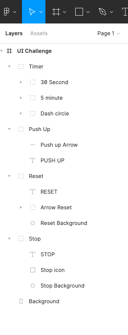
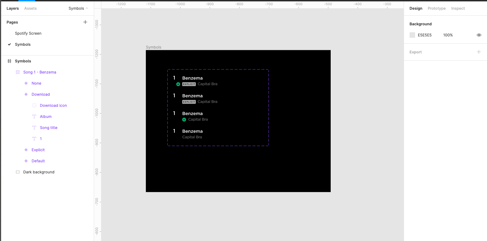

#### Find the Colors

###### Is the deliverable labeled as “Name_FirstName_DeliverableName_Date_VersionNumber”?

###### Is the deliverable in the correct format (Figma)?

###### Is there a title within the document?

###### Is the document clear, simple and easy to read?

###### Are there screenshots of the 7 pages or screens?

###### Does each screenshot have a URL next to it?

###### Do the main colors match with the ones from the screens?

#### Color codes

###### Is the deliverable labeled as “Name_FirstName_DeliverableName_Date_VersionNumber”?

###### Is the deliverable in the correct format (Figma)?

###### Is there a title within the document?

###### Is the document clear, simple and easy to read?

###### Does the file include screenshots of the main page, URL, extracted colors and the corresponding color codes?

###### Do the color codes match with the extracted colors ? You can use [Hex Color Codes](https://hexcolorcodes.org/) to confirm.

#### Color combinations

###### Is the deliverable labeled as “Name_FirstName_DeliverableName_Date_VersionNumber”?

###### Is the deliverable in the correct format (Figma)?

###### Is there a title within the document?

###### Is the document clear, simple and easy to read?

###### Do the websites or apps chosen match with a correct color wheel combinations?

###### Are there 3 websites or apps per color palette combination?

###### Are all websites or apps different from the examples in the instructions?

#### Moodboard

###### Is there a zip folder labeled as “ProjectTitle_Name_FirstName”?

###### Are the deliverables labeled as “Name_FirstName_DeliverableName_Date_VersionNumber”?

###### Are the deliverables in the correct format?

###### Are the documents clear, simple and easy to read?

##### For each Moodboard 1, 2, 3 and 4 check the folowing:

###### Are there several pictures that are graphically consistent?

###### Are there 2 to 3 main colors that stand out?

###### Is there only one color code per color (RGB, Hex, or HSB)?

###### Does the color code match the designated color? [Use this tool](http://onlinewebtool.com/colorpicker.php)

#### Typography

###### Is the deliverable labeled as “Name_FirstName_DeliverableName_Date_VersionNumber”?

###### Is the deliverable in the correct format (Figma)?

###### Is there a title within the document?

###### Is the document clear, simple and easy to read?

###### Are there 4 fonts from Unric.org?

###### Are there 3 fonts from Strongbowcider.org?

###### Are there 3 fonts from Bbqgrillsandfire.com?

###### Are there 3 fonts from Wikipedia.org?

###### Are there 7 fonts from Texasprivateinvestigator.com?

###### Is there 1 font from Bumble?

###### Are there 3 fonts from Adopteunepoule.fr?

###### Are there 3 fonts from Slaveryfootprint.org?

###### Is there 1 font from Tomorrowland.com?

###### Is there 1 font from Artisanscanada.com?

#### Typography Moodboard

###### Is the deliverable labeled as “Name_FirstName_DeliverableName_Date_VersionNumber”?

###### Is the deliverable in the correct format (Figma)?

###### Is there a title within the document?

###### Is the document clear, simple and easy to read?

##### For each Moodboard 1, 2, 3 and 4 check the folowing:

###### Are there 4 different fonts (one for each moodboard)?

###### Is there a typography for a title?

###### Is there a typography for a button?

###### Is there a typography for a description?

###### Is there a typography for the text?

#### UI Challenge Timer

###### Is the deliverable labeled as “Name_FirstName_DeliverableName_Date_VersionNumber”?

###### Is the deliverable in the correct format (Figma)?

###### Is there a title within the document?

###### Is the document clear, simple and easy to read?

###### Are there two half circles as this one?

###### Is there a 'PUSH UP' text and back arrow like in the image?

###### Is there a Stop button with the text underneath?

###### Is there a Reset button with the text underneath?

###### Is there a gradient background behind the number 5?

###### Are all the layers labeled and organized in groups?

#### UI Challenge Watches

###### Is the deliverable labeled as “Name_FirstName_DeliverableName_Date_VersionNumber”?

###### Is the deliverable in the correct format (Figma)?

###### Is there a title within the document?

###### Is the document clear, simple and easy to read?

###### Do the designed screens match the images?

###### Do all layers have a name and belong to a group of graphic elements?

###### Are there 2 pages: one for the screen and one with the symbols?

###### Is the overlay done with transparency?

###### Was the mask used to change the shape of the imported image?

#### UI Challenge Flight

###### Is the deliverable labeled as “Name_FirstName_DeliverableName_Date_VersionNumber”?

###### Is the deliverable in the correct format (Figma)?

###### Is there a title within the document?

###### Is the document clear, simple and easy to read?

###### Does the designed screen match the image?

###### Do all layers have a name and belong to a group of graphic elements?

###### Are there 2 pages: one for the screen and one with the symbols?

###### Have masks been used to change the shape of the image?

###### Is the overlay done with transparency?

#### UI Challenge - Spotify

###### Is the deliverable labeled as “Name_FirstName_DeliverableName_Date_VersionNumber”?

###### Is the deliverable in the correct format (Figma)?

###### Is there a title within the document?

###### Is the document clear, simple and easy to read?

###### Does the designed screen match the image?

###### Are there 2 pages: one for the screen and one with the symbols?

###### Are there symbols and variants for the songs in the Symbols page?

###### Is the background made with linear color?

###### Are all the elements gathered in groups?

###### Are all the layers named and organized?

###### Is there Apple Design System (head bar)?

#### UI Challenge Bitcoin Dashboard

###### Is the deliverable labeled as “Name_FirstName_DeliverableName_Date_VersionNumber”?

###### Is the deliverable in the correct format (Figma)?

###### Is there a title within the document?

###### Is the document clear, simple and easy to read?

###### Does the designed screen match the image?

###### Do all layers have a name and belong to a group of graphic elements?

###### Are there 2 pages: one for the screen and one with the symbols?

###### Is the overlay done with transparency?

###### Was the mask function used to change the shape of the image?

###### Was the linear color function used?
