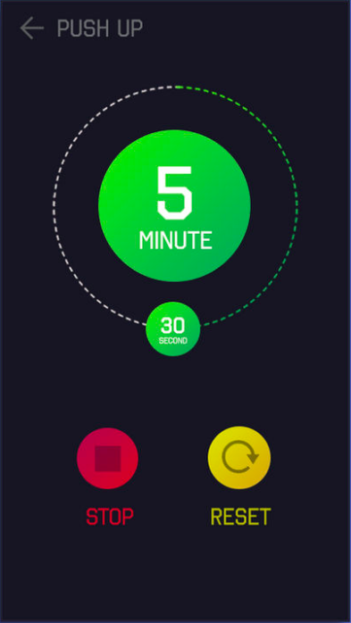

## UI Challenge - Timer

### Instructions

Create this image on Figma:

Please make sure you use:

- 2 half circles to draw the circle around the timer.
- Gradient to fill the main circle.
- Groups.
- Named layers.

**Deliverable:**

- A Figma file.

Don't forget to:

- Upload the Figma file on Github, labeled as follows: “Name_FirstName_DeliverableName_Date_VersionNumber”. For example, it can be labeled as “Doe_John_MidFiPrototype_05242024_V1”.
- Add a title within the file.

**Tips:**

- The font is RAJDANHI.
- The frame is Android 360 x 640px.
- Pay attention to the global aspect of the file. It must be clear, simple and easy to read. You can get inspiration [canva](https://www.canva.com/) but don’t overload your design with too much details!
