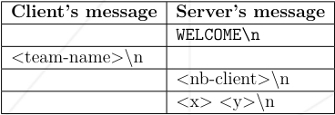

## zappy

### Objectives

You have to create Zappy, which is an entirely automatic game where some AI's play amongst themselves. It is about creating families, surviving by eating food and collecting stones in order to level up. Each level has different requirements for a ritual, which makes the adventure more and more difficult for the AI players, which play on their own, without any help form their creator. The game is over once six members of one family reach the highest possible level (8).

### Game presentation

### The Game Parts

Here are the different parts of the game:

- The `server` contains the field, the resources, and manages the logic and timing of the game.

- One or many `clients` will connect to the server and each will “pilot” one player. The players are spread over teams.

- A `graphic client` that connects to the server and displays the field and what happens there.

#### Geography

- The game consists in managing an entire world and its population. That world, "Trantor" is geographically made of plains that have no height, no crater, no valley or mountains.

- The game board represents the entire surface of that world, like a map. If a player exits on the right of the board, he will re-enter on the left.

- The game is played by teams. The winning team is the first one that will have its 6 players reach the maximum level.

### Resources

The location where we are is quite rich in resources, mining and food. All you need to do is to walk around and discover this wonderful food and many stones of various nature on the ground.

- These stones be of 6 distinct kinds:

  - linemate
  - deraumere
  - sibur
  - mendiane
  - phiras
  - thystame

- These resources must be randomly generated by the server, despite being random, the generation must have some logical rules.

### Rules

- Each player starts with 10 food (1260 time units) and 0 stones.
- Each player starts on level 1.
- As you level up, your player sight improves.
- You must eat to survive and not starve and die.
- You must collect stones to level up.
- Create a family of (at least) 6 and win the game.
- Hatch an egg if you need a spot in your family.

### The Trantorians Activities

The population of Trantor has two type of occupation:

- Get food to eat and not die of hunger.
- Look for stones, pick them up to create totems, have an elevation ritual and get to the next level.

Elevation is an important activity for Trantorians!

### Player

- The local is pacific, he is neither violent nor aggressive, he is happy just looking for stones and feeding on the way.

- He meets, without issues, other people on the same location and sees as far as the eye can see.

- It is impossible to guess the Trantorian orientation when crossing him.

- The food that the Trantorian picks up is the only resource he needs to live.

- One food unit allows him to survive 126 time units, so 126/t seconds. The more he picks up the more he lives.

- The Trantorian must also collect the stones in order to elevate, each level will require different combination of stones.

### Elevation ritual

- The goal for everyone is to reach the top of the Trantorian hierarchy.

- The ritual that allows to increase the Trantorian physical and mental capacities must be accomplished according to a particular rite. He needs to bring together on the same field unit (square):

  - A combination of stones
  - A certain number of players of the same level

- The player will start the incantation and the elevation will start. It is not necessary that all the players are on the same team. Only their collective levels matter. All players within the incantation group will reach the higher level.

- Passed on from generation to generation, the secret to the elevation goes as such:

| Level | Number of Players | linemate | deraumere | sibur | mediane | phiras | thystame |
| :---: | :---------------: | :------: | :-------: | :---: | :-----: | :----: | :------: |
|  1-2  |         1         |    1     |     0     |   0   |    0    |   0    |    0     |
|  2-3  |         2         |    1     |     1     |   1   |    0    |   0    |    0     |
|  3-4  |         2         |    2     |     0     |   1   |    0    |   2    |    0     |
|  4-5  |         4         |    1     |     1     |   2   |    0    |   1    |    0     |
|  5-6  |         4         |    1     |     2     |   1   |    3    |   0    |    0     |
|  6-7  |         6         |    1     |     2     |   3   |    0    |   1    |    0     |
|  7-8  |         6         |    2     |     2     |   2   |    2    |   2    |    1     |

### Vision

- For multiple reasons, the vision that the player has of the field is limited. With each elevation their vision goes up one unit of measure ahead and one on each side of a new row. Thus we obtain, for example, for the first 3 levels, the first two elevations, the following vision (our player is on 0):

```console

              ---- ---- ----
             | 1  | 2  | 3  |
              ---- ---- ----
                  | 0  |
                   ----
                  Level 1

         ---- ---- ---- ---- ----
        | 4  |  5 |  6 |  7 |  8 |
         ---- ---- ---- ---- ----
             | 1  | 2  | 3  |
              ---- ---- ----
                  | 0  |
                   ----
                  Level 2

 ----- ----- ----- ----- ----- ----- -----
|  9  | 10  | 11  | 12  | 13  | 14  | 15  |
 ----- ----- ----- ----- ----- ----- -----
      |  4  |  5  |  6  |  7  |  8  |
       ----- ----- ----- ----- -----
             | 1  | 2  | 3  |
              ---- ---- ----
                  | 0  |
                   ----
                  Level 3

```

For the player to know his surroundings, the `client` sends the command `SEE` and the server responds the following chain of characters (for level 1):

```console
{content-square-0, content-square-1, content-square-2, content-square-3}
```

Our player doesn't even see himself, and if there is more than 1 object in a box, they are all indicated and separated by a space:

```console
              -------- -------- --------
             | sibur  | Phiras |        |
             | player | Phiras |        |
              -------- -------- --------
                      |        |
                      |  food  |
                       --------
                        Level 1

```

```console
{food, player sibur, phiras phiras, }
```

### The Time and Game Speed

The game speed is defined by a time unit. Each action in the game has a duration proportionate to this time unit.

The time unit is defined by the function 1/t :

- t is passed as parameter at the start of the server.
- A time unit lasts 1/t seconds.

- No active wait time will be tolerated.
- There cannot be any blocking when the clients are stopped, or in any phase of the game.
- The Trantorians have adopted an international time unit.
- Time unit is a second. If `t=1` “forward” takes 7 seconds. We choose by default, t=100. t is a integer.
- The time reference is absolute time.

### Objects denomination

Only the classification of an object can be identifiable. It is therefore impossible to distinguish two objects of the same class. For example, two `siburs` will have the same denomination since they belong to the same class.

### Teams

At the beginning a team is made of n player and only n. Each player is controlled by a client. The clients cannot communicate or exchange amongst each other data outside of the game, in any way.

At the beginning the client has 10 life units, he can therefore survive 1260 time units, 1260/t seconds.

### Reproduction

A player can reproduce with the `fork` command. The execution of this command results in the production of an egg.

Once the egg is laid, the player that laid the egg can go around until it hatches. Once the egg has hatched, a new player comes out, and is given a random direction.
This operation authorizes the connection of a new client.

The `connect_nbr` command returns the number of authorized and unauthorized connections for this team.

- Time to lay an egg: 42/t

- Time for the egg to hatch 600/t

### Inventory

The command `inventory` allows you to see what objects the player has and how long it has to live. The server will send back for example the following line:

```
{food 345, sibur 3, phiras 5, ..., deraumere 0}
```

### Kick

A player can expulse all the players sharing the same square. It pushes them in the direction he is looking at. When a client sends the `kick` command to the server, all the clients in this square receive the following line:

```
moving <K>\n
```

With K indicating the direction of the square where the player comes from. Basically saying that you are getting out of that square.

### The commands

Each player responds to the following actions and only with the following syntax:


|                      Action                       |      Command      | Delay/time |         Response         |
| :-----------------------------------------------: | :---------------: | :--------: | :----------------------: |
|                advance one square                 |      advance      |    7/t     |            ok            |
|               turn right 90 degrees               |       right       |    7/t     |            ok            |
|               turn left 90 degrees                |       left        |    7/t     |            ok            |
|                        see                        |        see        |    7/t     | {square1, square2, ...}  |
|                     inventory                     |     inventory     |    1/t     | {phiras n, sibur n, ...} |
|                  take an object                   |  take \<object>   |    7/t     |          ok/ko           |
|                put down an object                 |   put \<object>   |    7/t     |          ok/ko           |
|           kick a player from the square           |       kick        |    7/t     |          ok/ko           |
|                     broadcast                     | broadcast \<text> |    7/t     |            ok            |
|               begin the incantation               |    incantation    |   300/t    |  elevation in progress   |
|                                                   |                   |            |    current level : K     |
|                   fork a player                   |       fork        |    42/t    |            ok            |
| know the number of unused connections by the team |    connect_nbr    |    0/t     |          value           |
|                 death of a player                 |         -         |     -      |          death           |

All the commands are transmitted through a character string that ends with a newline.
In case of any unknown or bad command the server must respond "ko".

### Sound Transmission

Sound is a wave that moves in a linear manner.

All the players hear the broadcasts without knowing who emits them. They perceive only the direction the sound comes from and the message. The number of squares crossed by the sound before it arrives to the player indicates the direction. This numbering is done through the attribution of `1` to the square in front of the player, then a count down of the squares surrounding the player in the trigonometric direction (counter-clock wise). The world is round, therefore we will choose the shortest trajectory for the sound between the transmitter to the player for which we calculate.

The following example indicates the sound trajectory that we must choose, as well as the numbers of the squares around the player. The player receives the broadcast through square 3.


In case the broadcast is emitted from the same box as the receiving player, he will get the message from square 0

### Broadcast

To send a message, the client must send to the server the following command:

```
broadcast <text>
```

The server will send to all its client this line:

```
message <K>,<text>
```

With K indicating the square where the sound comes from.

### The Server

The server is the main engine that will interfere between the AI and the GUI. It will exchange all data with the AI and execute these instructions. At the same time, it send the information to the GUI. It can be written in one of these languages [C - C++ - Rust - Go].

For this part, you must create a TCP server to make a connection between clients and manage the entire world:

- The server port.
- The number of teams and their names.
- The dimension of the world map.
- The number of clients authorized at the beginning of the game.

#### Server Instructions

- Your server must generate all the resources. The generation must be in a random way.
- Any request to your server must never hang forever. It must never block, and the `client` can be appropriately bounced if necessary.
- The server executes the requests of the `client` in the order they are received.
- The requests are buffered and the execution time of the command will only block the player concerned.
- It's forbidden to use any `exec` functions to run another server.
- It must stay available at all costs.

You are allowed to use threads but think outside of the box.

```console
$ ./server
	Usage: ./server -p <port> -x <width> -y <height> nt <team> [<team>] [<team>] ... -c <nb> [-t <t>]
    -p  is the port number
    -x  is the width of the world
    -y  is the height of the world
    -n  is the name of the team
    -c  is the number of authorized clients per team
    -t  is the reciprocal of time unit for execution of actions
```

### The Client

The Client can be written in one of these languages:

- C
- C++
- Rust
- Go
- Js
- Python

```console
$./client
Usage: ./client -n <team> -p <port> [-h <hostname>]
  -n is the name of the team
  -p is the port number
  -h is the name of the host, the default is localhost
```

The client is autonomous, after its launch the user won’t influence its operation. He pilots a drone (player).

The client must send the command order to the server without any intervention from humans.

### Client/server communication

The communication between client and server will happen via sockets and tcp. The port used must be indicated in the programs parameters.

The client will send its requests without waiting for their execution, the server sends back a "welcome" message confirming the successful execution of the requests.

The connection client to server will happen as such:



The `nb-client` indicates the number of clients that can still be accepted by the server for the team `team-name`. If that number is greater than 1 a new client connects. X and Y indicate the world’s dimensions.

If the team name passed by the client doesn't exist the server must print `"Error: the team <name of team> doesn't exist"`

> The client can send successively up to 10 requests without response from the server. Beyond 10 the server will no longer take them into account.

If a player/client join the game, it does not join as one character in the game, but as a family of six members in the form of one team.

There is no chat room or sharing of data between players. Still, the Player can broadcast a message through a command-line sent to the server, which will be broadcasted to all players; All details are in the sound transmission part.

The server executes the client requests in the order that they are received. The requests are buffered and the execution time of the command will only block the player concerned. `x` and `y` indicates the dimensions of the world.

### Graphic interface

To have a better vision of the game, which is simple, clear and ergonomic, the project will need to have a graphic visualization client. That client will propose a real-time representation of the world as it is on the server.

The Graphic part must be done with one of these languages:

- Javascript
- Python
- C
- C++

- Using any game Engine is forbidden!

- The interface will integrate at least a 2D visualization through icons allowing a representation of the world.
- You need to make sure that it is possible to visualize the items in the game.
- You need to implement the the possibility of clicking on a square to see the details of it, like how many of each items it has inside. It should look like a floating window, tooltip, or something else.
- You need to include the visualization of the sounds.

This can be developed in C, PHP, Perl, Python, etc. And will communicate within the network with the `server` to retrieve the content of the `map, teams, inventories, etc`. For example, everything needed to see what is going on in the game.

### BONUS

- Create a 3D interface or any other type of representation.
- Create the server using only one process (No THREADS)
