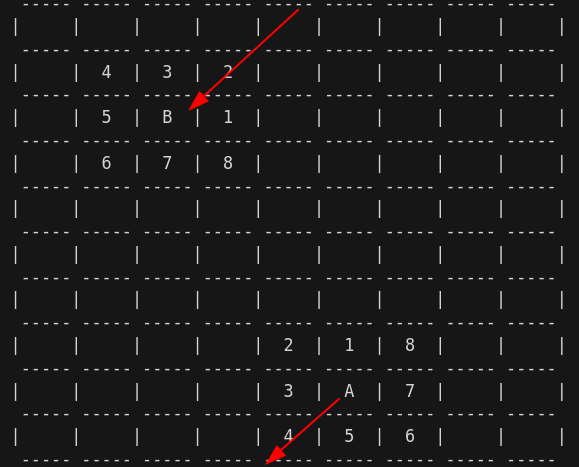

## Zappy Project

### Objectives

Zappy is an automatic video Game where AIs play with each other, The Game is about building a world and managing its population; we are going to call this world Trantor.

### Instructions

### Game presentation

- Geographically Trantor is made of plains with no height, no carter, no valley, no mountains.
- The game board represents the entire world's surface like a map containing food and stones and the population of Trantor, "the Trantorians."
- The "Trantorions" lives in harmony and peace with everyone, They only eat food so they Can stay alive, look for stones, pick them up to create totems, and have a ritual to get to the next level of the game, it will be all explained later.
- Each level has different requirements for a ritual, making the adventure more and more difficult for the AI players, who play independently without help from their creator.

### Players

- If a player (or you call it a client ) Join the game, it does not Join as one character in the game, but as six characters or players play in the form of one team, the game does support Multiplayers, but players cannot share data between them outside the game in any way.
- Teams play the game.
- The game is over once six members of one family reach the highest possible level (8).
- There is no chat room or sharing of data between players. Still, the Player can broadcast a message through a command-line sent to the server, which will be broadcasted to all players;  All details are in the sound transmission part.

### The Game Parts

Here are the different parts of the game:

- The `server` contains the field and the resources and manages the logic and timing of the game.
- One of many `clients` will connect to the server, and each will “pilot” one player. The players do spread over teams.
- A graphic client connects to the server and displays the field and what happens there.

### The Game Speed 

A time unit defines the game speed. Each action in the game has a duration proportionate to this time unit.
The function 1/t defines the time unit:

- t is passed as a parameter at the start of the server.
- A time unit lasts 1/t second.

### The Game Resources

The location is exceptionally rich in resources, mining, and food.
Walk around on the game board to discover fantastic food and many stones of varied nature on the ground.
- These stones are of 6 distinct kinds:
  - linemate
  - dreamer
  - sibur
  - mendiane
  - phiras
  - thystame
- The server must randomly generate these resources. Despite being random, the generation must have some logical rules.

### The Trantorians!

### The population Activities

The population of Trantor has two types of occupation:

- Get food to eat and not die of hunger.
- Look for stones, pick them up to create totems, have an elevation ritual, and get to the next level.

The elevation is an essential activity for Trantorians!

### Individuals

- The local is pacific. It is neither violent nor aggressive and happy, just looking for stones and feeding on the way.
- He meets, without issues, other people in the exact location and sees as far as the eye can see.
- It is impossible to guess the Trantorian orientation when crossing him.
- The food the Trantorian picks up is the only resource he needs to live.
- One food unit allows it to survive 126-time units, so 126/t seconds. 
- The more he picks, the more he lives.
- The Trantorian must also collect the stones from elevating; each level will require a different combination of stones. 
We will explain more later.

### Elevation ritual

- The goal for everyone is to reach the top of the `Trantorian` hierarchy.
- The ritual that allows increasing the Trantorian physical and mental capacities must be accomplished according to a particular rite. He needs to bring together the same field unit:

- A combination of stones
- A certain number of players of the same level
- The player will start the incantation, and the elevation will start.
- Not all the players need to be on the same team. 
- Only their collective levels matter. 
- All players within the incantation group will reach a higher level.
- Passed on from generation to generation, the secret to the elevation goes as such:

| Level | Number of Players | linemate | deraumere | sibur | mediane | phiras | thystame |
| :---: | :---------------: | :------: | :-------: | :---: | :-----: | :----: | :------: |
|  1-2  |         1         |    1     |     0     |   0   |    0    |   0    |    0     |
|  2-3  |         2         |    1     |     1     |   1   |    0    |   0    |    0     |
|  3-4  |         2         |    2     |     0     |   1   |    0    |   2    |    0     |
|  4-5  |         4         |    1     |     1     |   2   |    0    |   1    |    0     |
|  5-6  |         4         |    1     |     2     |   1   |    3    |   0    |    0     |
|  6-7  |         6         |    1     |     2     |   3   |    0    |   1    |    0     |
|  7-8  |         6         |    2     |     2     |   2   |    2    |   2    |    1     |


### Vision

- For multiple reasons, the player's vision of the field is limited. With each elevation, their vision goes up one unit of measure ahead and one on each side of a new row. Thus we obtain, for example, for the first three levels, the first two elevations, the following vision (our player is on 0):

```console

              ---- ---- ----
             | 1  | 2  | 3  |
              ---- ---- ----
                  | 0  |
                   ----
                  Level 1

         ---- ---- ---- ---- ----
        | 4  |  5 |  6 |  7 |  8 |
         ---- ---- ---- ---- ----
             | 1  | 2  | 3  |
              ---- ---- ----
                  | 0  |
                   ----
                  Level 2

 ----- ----- ----- ----- ----- ----- -----
|  9  | 10  | 11  | 12  | 13  | 14  | 15  |
 ----- ----- ----- ----- ----- ----- -----
      |  4  |  5  |  6  |  7  |  8  |
       ----- ----- ----- ----- -----
             | 1  | 2  | 3  |
              ---- ---- ----
                  | 0  |
                   ----
                  Level 3

```

For the player to know his surroundings, the `client` sends the command `SEE,` and the server responds with the following chain of characters (for level 1):

```console
{content-square-0, content-square-1, content-square-2, content-square-3}
```
Our player does not even see himself, and if there is more than one object in a box, they are all indicated and separated by a space:


```console
              -------- -------- --------
             | sibur  | Phiras |        |
             | player | Phiras |        |
              -------- -------- --------
                      |        |
                      |  food  |
                       --------
                        Level 1

```

```console
{food, player sibur, phiras phiras, }
```

### Time

- No active wait time will be tolerated. There cannot be any blocking when the clients are stopped, or in any phase of the game.
- The Trantorians have adopted an international time unit. The Time unit is a second. If `t=1` “forward” takes 7 seconds.
- We choose by default, t=100. t is an integer.
- The time reference is absolute time.

### Objects denomination

Only the classification of an object can be identifiable. It is therefore impossible to distinguish two objects of the same class. For example, two `siburs` will have the same denomination since they belong to the same class.

### Reproduction

A player can reproduce with the `fork command`. The execution of this command results in the production of an egg. Once the egg is laid, the player that laid the egg can go around until it hatches. 

When the egg hatches a new player pops. He is oriented randomly. This operation authorizes the connection of a new client. The `connect_nbr` command returns the number of authorized and unauthorized connections for this team.

- Time to lay an egg: 42/t

- Time for the egg to hatch at 600/t

### Inventory

The command `inventory` allows you to see what objects the player has and how long it has to live. The server will send back for example the following line:

```
{food 345, sibur 3, phiras 5, ..., deraumere 0}
```

### Kick

A player can expulse all the players sharing the same square. It pushes them in the direction he is looking at. When a client sends the `kick` command to the server, all the clients in this square receive the following line:

```
moving <K>\n
```

With K indicating the direction of the square where the player comes from. Basically saying that you are getting out of that square.


### Teams

In the beginning, a team is made of n players and only n. A client controls each player. The clients cannot communicate or exchange each other data outside of the game in any way.
In the beginning, the client has ten life units; he can survive 1260 time units, 1260/t seconds.

### The commands

Each player responds to the following actions and only with the following syntax:


|                      Action                       |      Command      | Delay/time |         Response         |
| :-----------------------------------------------: | :---------------: | :--------: | :----------------------: |
|                advance one square                 |      advance      |    7/t     |            ok            |
|               turn right 90 degrees               |       right       |    7/t     |            ok            |
|               turn left 90 degrees                |       left        |    7/t     |            ok            |
|                        see                        |        see        |    7/t     | {square1, square2, ...}  |
|                     inventory                     |     inventory     |    1/t     | {phiras n, sibur n, ...} |
|                  take an object                   |  take \<object>   |    7/t     |          ok/ko           |
|                put down an object                 |   put \<object>   |    7/t     |          ok/ko           |
|           kick a player from the square           |       kick        |    7/t     |          ok/ko           |
|                     broadcast                     | broadcast \<text> |    7/t     |            ok            |
|               begin the incantation               |    incantation    |   300/t    |  elevation in progress   |
|                                                   |                   |            |    current level : K     |
|                   fork a player                   |       fork        |    42/t    |            ok            |
| know the number of unused connections by the team |    connect_nbr    |    0/t     |          value           |
|                 death of a player                 |         -         |     -      |          death           |

All the commands are transmitted via a chain of characters that end with a newline.

### Sound Transmission

Sound is a wave that moves in a linear manner.

All the players hear the broadcasts without knowing who emits them. They perceive only the direction the sound comes from and the message. The number of squares crossed by the sound before it arrives at the player indicates the direction. This numbering is done through the attribution of `1` to the square in front of the player, then a count down of the squares surrounding the player in the trigonometric direction (counter-clock wise). The world is round, therefore we will choose the shortest trajectory for the sound between the transmitter to the player for which we calculate.

The following example indicates the sound trajectory that we must choose, as well as the numbers of the squares around the player. The player receives the broadcast through square 3.



In case the broadcast is emitted from the same box as the receiving player, he will get the message from square 0

### Broadcast

To send a message, the client must send to the server the following command:

```
broadcast <text>
```

The server will send to all its client this line:

```
message <K>,<text>
```

With K indicating the square where the sound comes from.

### The Server

The server can be written in one of these languages [C - C++ - Rust - Go].

in this part, you must create a TCP server to make a connexion between clients and manage the entire world 
- Port of the server
- Number of teams and their names
- Dimension of the world map
- number of clients authorized at the beginning of the game

#### Instructions

- Your server must generate all resources. The generation must be in a random way.
- Your server must never block, and the client can be appropriately bounced if necessary
- Any request to your server must never hang forever.
- It's forbidden to use any `exec` functions to run another server.
- Stress tests your server. It must stay available at all costs.
- You are allowed to use Thread but think out of the box.

```console
$ ./server
	Usage: ./server -p <port> -w <width> -y <height> -nt <team> [<team>] [<team>] ... -c <nb> [-t <t>]
	-p port number
	-w world width
	-y world height
	-nt team_name_1 team_name_2 ...
	-c number of clients authorized at the beginning of the game
	-t [100] time unit divider (the greater t is, the faster the game will go)
```

The server executes the requests of the client in the order they are received. The
requests are buffered and the execution time of the command will only block the player
concerned.

### The Client
The Client can be written in one of these languages [C - C++ - Rust - Go - Js - Python...]

```console
$./client
Usage: ./client -n <team> -p <port> [-h <hostname>]
        -n team_name
        -p port
        -h name of the host , the default is localhost
```
The client is autonomous, after its launch the user won’t influence its operation. He
pilots a drone (player).

The client must send the command order to the server without any intervention from humans.

 
### Client/server communication

The communication between client and server will happen via sockets and TCP. The port used will be indicated in the program's parameters.

The client will send its requests without waiting for their execution, the server sends back a message confirming the successful execution of the requests.

The connection client to server will happen as such:

| client’s message | server’s message |
| :--------------: | :--------------: |
|                  |    WELCOME\n     |
|  \<team-name>\n  |                  |
|                  |  \<nb-client>\n  |
|                  |   \<x> \<y>\n    |

The `nb-client` indicates the number of clients that can still be accepted by the server for the team `team-name`.
If that number is greater than 1 a new client connects.
If the team name passed by the client doesn't exist the server must print `"Error: the team <name of team> doesn't exist"`

> The client can send successively up to 10 requests without a response from the server. Beyond 10 the server will no longer take them into account.

The server executes the client requests in the order that they are received. The requests are buffered and the execution time of the command will only block the player concerned.
x and y indicate the dimensions of the world.

### Graphic interface

The Graphic part must be done with one of these functions Javascript and Python and C, C++

Using any game Engine is forbidden.

The project will have to have a graphic visualization client. That client will propose a real-time representation of the world as it is on the server.

The interface will integrate at least a 2D visualization through icons allowing a representation of the world. You also need to include the visualization of the sounds.

This can be developed in C,  PHP, Perl, Python, etc. And will communicate within the network with the `server` to retrieve the content of the `map, teams, inventories, etc`. For example, everything needed to see what is going on in the game.

### BONUS

- A 3D interface or any other type of representation will be an appreciated bonus for this project.
- Create the server using only one process (No THREADS)
